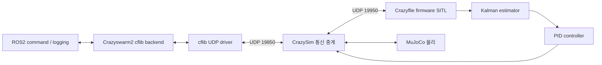
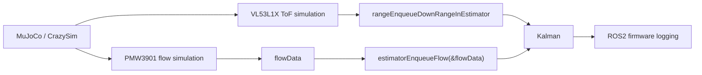
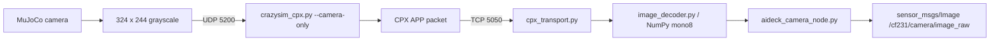
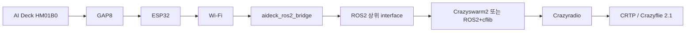

# SIL 구조와 source 근거

## Flight 경로

launch에서 backend=cflib, mocap=false, gui=false, teleop=false를 지정합니다. firmware의 motor output과 MuJoCo 상태/센서 입력이 루프를 구성합니다. 19850은 firmware port 19950에 offset -100을 적용한 cflib 쪽 UDP 연결입니다. 이를 같은 port로 합치면 안 됩니다.

근거: crazysim_bringup/launch/single_cf.launch.py, crazyflie/config/crazyflies.yaml, firmware/sitl_make/CMakeLists.txt, simulator_files/mujoco/crazysim.py의 CFLIB_PORT_OFFSET.

## Flow Deck 경로

firmware/src/hal/src/sensors_sitl.c가 dpixelx/dpixely와 dt를 수신 데이터에서 구성합니다. stdDevX와 stdDevY는 각각 2.0f입니다. `estimatorEnqueueFlow`를 호출하므로 motion.deltaX/deltaY driver logging을 읽는 구조와 다릅니다.

ToF: range.zrange → /cf231/tof. Optical flow 관측: kalman_pred.measNX, measNY, predNX, predNY → /cf231/flow. 모두 Crazyswarm2 custom logging 설정에서 요청하며 LogDataGeneric를 사용합니다. ToF/flow config 주파수는 20 Hz입니다.

현재 simulation은 dynamic PMW3901 SQUAL, texture-dependent quality를 계산하지 않습니다. texture가 어두워졌다고 실제 PMW3901과 같은 실패 특성이 자동 재현되는 것은 아닙니다.

## Camera 경로

cpx_transport.py는 4-byte wire header `<HBB`를 읽고 source=GAP8(4), destination=HOST(3), function=APP(5)를 선택합니다. image header packet 이후 last flag까지 payload를 모읍니다. image_decoder.py는 11-byte AI Deck header `<BHHBBI`를 읽습니다.

| field | baseline 값 |
|---|---|
| magic | 0xBC |
| width / height | 324 / 244 |
| depth / format | 8 / 0 |
| size | 79056 |

현재 decoder는 magic, dimension, size와 raw pixel 수를 검증합니다. 모든 image format을 지원하는 범용 decoder라고 볼 수 없으며 depth/format의 추가 검증을 이번 작업에서 임의 변경하지 않았습니다. node는 mono8, step=width, is_bigendian=0으로 publish하고 sensor-data QoS를 사용합니다. OpenCV 변환을 사용하지 않습니다.

## CPX camera-only가 필요한 이유

기존 fpv.py는 camera 외에 cflib Crazyflie 연결과 arming/hover control에도 관여합니다. CPX bridge가 CRTP response를 가져가면 Crazyswarm2의 flight/logging ownership과 충돌합니다. camera가 나오더라도 ToF/flow가 끊기는 원인이 될 수 있습니다.

camera_only=True일 때:

- `_crtp_to_cpx_loop` thread를 시작하지 않습니다.
- 수신한 CPX_F_CRTP packet을 UDP 19850으로 forwarding하지 않습니다.
- camera APP stream 전송 경로를 유지합니다.

따라서 flight/flow는 Crazyswarm2 → UDP 19850, camera는 CPX APP → TCP 5050으로 분리됩니다. TCP client는 camera node 하나를 사용하며 FPV viewer를 동시에 띄우지 않습니다. socket 객체가 생성되는 것과 CRTP forwarding이 실행되는 것은 다릅니다.

## Launch와 시간 순서

single_cf.launch.py가 sitl_camera.sh를 실행합니다. 이 script가 firmware를 시작하고 CPX camera-only, MuJoCo --camera --flowdeck을 실행합니다. camera node는 TimerAction(4.0), Crazyswarm2는 TimerAction(7.0)으로 지연됩니다. 이 값은 보존했습니다. 강건한 준비 상태 handshake를 새로 추가한 것은 아닙니다.

scene override는 launch의 scene argument입니다. obstacles의 geom에 contype=1/conaffinity=1이 있어 충돌 설정을 유지합니다. box size는 half-size입니다.

## 실기체 전환 목표

상위 topic/interface는 가능한 유지하면서 transport를 교체하는 설계 방향입니다. 실제 frame protocol, network, radio, firmware 및 비행 안전 검증은 별도 작업입니다. 이 Public checkout에는 hardware interface를 새로 구현하지 않았습니다.
